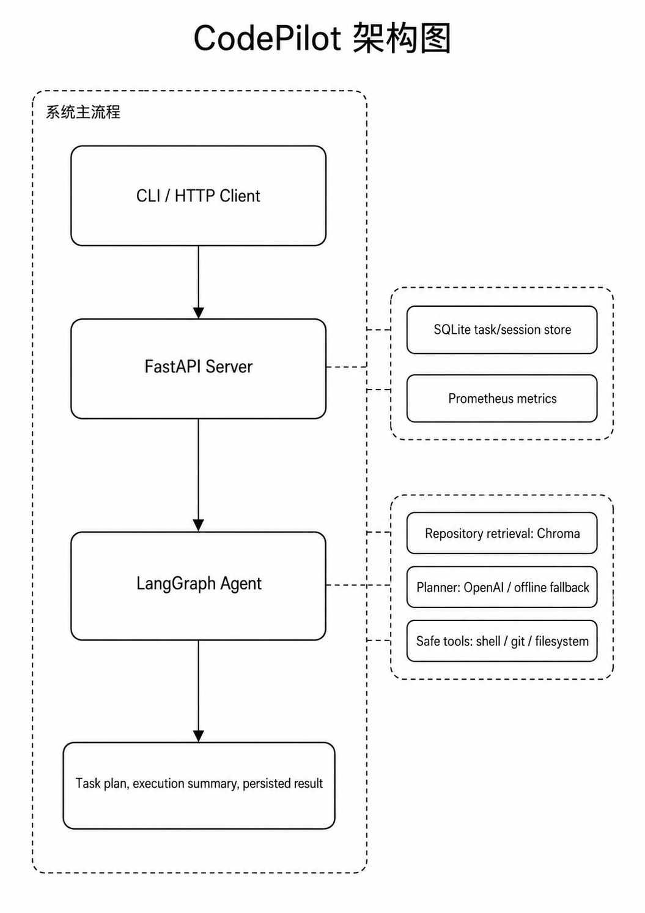

# CodePilot

面向私有代码仓库的本地智能开发助手 MVP，支持 CLI、HTTP API、仓库索引、任务记录、安全工具调用、Prometheus 指标暴露和本地压测。

<!-- PROJECT SHIELDS -->

[![Contributors][contributors-shield]][contributors-url]
[![Forks][forks-shield]][forks-url]
[![Stargazers][stars-shield]][stars-url]
[![Issues][issues-shield]][issues-url]
[![MIT License][license-shield]][license-url]
[![Python][python-shield]][python-url]

<!-- PROJECT LOGO -->
<br />

<p align="center">
  <a href="https://github.com/CozyOct1/codepilot">
    
  </a>

  <h3 align="center">CodePilot</h3>
  <p align="center">
    一个面向私有仓库的本地开发助手，用于验证代码仓库索引、Agent 任务编排、安全工具调用和接口压测优化。
    <br />
    <a href="https://github.com/CozyOct1/codepilot"><strong>查看项目源码 »</strong></a>
    <br />
    <br />
    <a href="https://github.com/CozyOct1/codepilot">项目首页</a>
    ·
    <a href="https://github.com/CozyOct1/codepilot/issues">报告 Bug</a>
    ·
    <a href="https://github.com/CozyOct1/codepilot/issues">提出新特性</a>
  </p>
</p>

本篇 `README.md` 面向开发者，内容基于当前项目真实代码和本地实测结果编写。

## 目录

- [上手指南](#上手指南)
  - [开发前的配置要求](#开发前的配置要求)
  - [安装步骤](#安装步骤)
  - [基础使用](#基础使用)
- [项目功能](#项目功能)
- [文件目录说明](#文件目录说明)
- [开发的架构](#开发的架构)
- [HTTP API](#http-api)
- [MCP 工具](#mcp-工具)
- [部署](#部署)
- [压测与量化结果](#压测与量化结果)
- [使用到的框架](#使用到的框架)
- [版本控制](#版本控制)
- [当前限制](#当前限制)
- [作者](#作者)
- [版权说明](#版权说明)

## 上手指南

CodePilot 当前定位是单机私有仓库辅助开发工具，主要验证以下能力：

- 对本地仓库建立可检索索引
- 根据自然语言请求生成执行计划
- 在受限工具层内查看仓库状态、运行测试和查看 Diff
- 通过 SQLite 持久化任务、会话和执行结果
- 通过 FastAPI 对外提供任务、索引和指标接口
- 通过本地压测脚本量化接口吞吐和延迟表现

### 开发前的配置要求

1. Python 3.10+
2. uv
3. Docker 和 Docker Compose，可选，用于启动 Redis、Prometheus、Grafana、Nginx
4. OpenAI API Key，可选；未配置时会使用离线兜底计划

### 安装步骤

1. Clone the repo

```bash
git clone git@github.com:CozyOct1/codepilot.git
cd codepilot
```

2. 安装依赖

```bash
uv sync --locked
```

3. 运行测试

```bash
uv run pytest
```

4. 查看命令行帮助

```bash
uv run codepilot --help
```

### 基础使用

初始化当前仓库：

```bash
uv run codepilot init --repo . --name CodePilot
```

构建仓库索引：

```bash
uv run codepilot index --repo .
```

询问项目结构：

```bash
uv run codepilot ask "请概括当前项目模块" --repo .
```

运行测试：

```bash
uv run codepilot test --repo .
```

查看 Diff：

```bash
uv run codepilot diff --repo .
```

查看任务历史：

```bash
uv run codepilot tasks --repo .
```

## 项目功能

| 能力 | 当前实现 |
| --- | --- |
| CLI 工作流 | 初始化、索引、问答、任务执行、测试、Diff、任务列表、远程 API 调用 |
| HTTP API | 健康检查、指标、会话创建、任务创建/查询、聊天任务、仓库索引 |
| Agent 编排 | 基于 LangGraph 串联检索、计划生成和执行阶段 |
| 仓库索引 | 使用 Chroma 持久化本地索引，支持 Python、Markdown、JSON、YAML、前端源码等文本文件 |
| 离线运行 | 未配置 `OPENAI_API_KEY` 时使用确定性兜底计划，保证测试和演示可运行 |
| 数据持久化 | 使用 SQLite、SQLModel、SQLAlchemy 存储会话、任务、消息、工具调用和文件变更 |
| 安全工具层 | 文件访问限制在仓库内，Shell 命令使用允许列表并阻断高风险 token |
| 可观测性 | 暴露 Prometheus 格式指标，记录任务数量、工具调用次数和工具耗时 |
| 本地部署 | 提供 Redis、Prometheus、Grafana、Nginx 的 Docker Compose 配置 |

## 文件目录说明

```text
CodePilot
├── codepilot/
│   ├── agent/          LangGraph Agent 工作流
│   ├── cli/            Typer 命令行入口
│   ├── core/           配置、数据库、指标、Redis 辅助模块
│   ├── indexer/        仓库索引与检索
│   ├── mcp_server/     MCP 工具服务
│   ├── server/         FastAPI 应用和请求模型
│   ├── tools/          文件系统、Shell、Git、安全工具
│   └── workers/        Worker 入口
├── deploy/             Docker Compose、Nginx、Prometheus 配置
├── scripts/            本地工具脚本
├── skills/             本地 Agent Skill prompt 资源
├── tests/              pytest 测试
├── main.py             项目入口
├── pyproject.toml      Python 项目配置
├── uv.lock             uv 锁定文件
├── LICENSE             MIT License
└── README.md
```

## 开发的架构

<p align="center">
  
</p>

## HTTP API

启动服务：

```bash
uv run codepilot serve --host 0.0.0.0 --port 8001
```

健康检查：

```bash
curl http://127.0.0.1:8001/health
```

Prometheus 指标：

```bash
curl http://127.0.0.1:8001/metrics
```

创建任务但不执行 Agent：

```bash
curl -X POST http://127.0.0.1:8001/api/tasks \
  -H "Content-Type: application/json" \
  -d '{"repo_path":"/data/niewenjie/CodePilot","user_request":"请解释这个项目","run":false}'
```

创建并执行任务：

```bash
curl -X POST http://127.0.0.1:8001/api/tasks \
  -H "Content-Type: application/json" \
  -d '{"repo_path":"/data/niewenjie/CodePilot","user_request":"请运行测试并总结结果","run":true}'
```

查看最近任务：

```bash
curl "http://127.0.0.1:8001/api/tasks?limit=20"
```

通过 API 构建索引：

```bash
curl -X POST "http://127.0.0.1:8001/api/index?repo_path=/data/niewenjie/CodePilot"
```

## MCP 工具

启动 MCP Server：

```bash
uv run python -m codepilot.mcp_server.server
```

当前暴露工具：

```text
filesystem_list_dir
filesystem_read_file
filesystem_write_file
filesystem_search_text
shell_run_command
git_status
git_diff
```

安全约束：

- 文件路径会解析并限制在目标仓库内。
- Shell 命令必须以允许的命令前缀开头。
- 默认阻断 `sudo`、`rm`、`mkfs`、`dd`、`chmod`、`chown`、`curl`、`wget` 等高风险 token。

## 部署

本仓库的 Docker Compose 主要用于启动依赖组件和观测组件，不包含 CodePilot API 应用容器。API 服务需要通过 `uv run codepilot serve` 在本机启动。

启动 Redis、Prometheus 和 Grafana：

```bash
docker compose --env-file .env \
  -f deploy/docker-compose.yml \
  -f deploy/docker-compose.local.yml \
  up -d redis prometheus grafana
```

启动可选 Nginx 反向代理：

```bash
docker compose --env-file .env \
  -f deploy/docker-compose.yml \
  -f deploy/docker-compose.local.yml \
  --profile proxy \
  up -d nginx
```

默认端口：

| 服务 | 端口 |
| --- | ---: |
| CodePilot API | 8001 |
| Redis | 6379 |
| Prometheus | 9090 |
| Grafana | 3000 |
| Nginx | 8080 |

Grafana 本地默认账号：

```text
admin / admin
```

## 压测与量化结果

项目提供轻量本地 HTTP 压测脚本：

```bash
uv run python scripts/load_test.py --endpoint health --requests 1000 --concurrency 50
uv run python scripts/load_test.py --endpoint metrics --requests 300 --concurrency 20
uv run python scripts/load_test.py --endpoint tasks --requests 300 --concurrency 20
```

当前实测结果：

| 接口 | 请求数 | 并发 | 成功率 | 吞吐 | P50 | P95 |
| --- | ---: | ---: | ---: | ---: | ---: | ---: |
| `GET /health` | 1000 | 50 | 100% | 261.16 req/s | 39.35ms | 459.34ms |
| `GET /metrics` | 300 | 20 | 100% | 208.53 req/s | 12.96ms | 959.42ms |
| `POST /api/tasks` | 300 | 20 | 100% | 146.09 req/s | 112.73ms | 667.83ms |

相关优化：

- SQLite 启用 `journal_mode=WAL`
- 设置 SQLite `busy_timeout=30000`
- 调整 SQLAlchemy 连接池和溢出连接数
- 对 SQLite 写操作增加短进程内写锁
- 关闭 Uvicorn access log，减少压测时日志 IO 干扰

## 使用到的框架

- [uv](https://docs.astral.sh/uv/)
- [Typer](https://typer.tiangolo.com/)
- [Rich](https://rich.readthedocs.io/)
- [FastAPI](https://fastapi.tiangolo.com/)
- [LangGraph](https://langchain-ai.github.io/langgraph/)
- [LangChain OpenAI](https://python.langchain.com/docs/integrations/chat/openai/)
- [Chroma](https://www.trychroma.com/)
- [SQLModel](https://sqlmodel.tiangolo.com/)
- [SQLAlchemy](https://www.sqlalchemy.org/)
- [Prometheus Client](https://github.com/prometheus/client_python)
- [pytest](https://docs.pytest.org/)
- [Docker Compose](https://docs.docker.com/compose/)


## 版权说明

该项目签署 MIT 授权许可，详情请参阅 [LICENSE](LICENSE)。

<!-- links -->
[contributors-shield]: https://img.shields.io/github/contributors/CozyOct1/codepilot.svg?style=flat-square
[contributors-url]: https://github.com/CozyOct1/codepilot/graphs/contributors
[forks-shield]: https://img.shields.io/github/forks/CozyOct1/codepilot.svg?style=flat-square
[forks-url]: https://github.com/CozyOct1/codepilot/network/members
[stars-shield]: https://img.shields.io/github/stars/CozyOct1/codepilot.svg?style=flat-square
[stars-url]: https://github.com/CozyOct1/codepilot/stargazers
[issues-shield]: https://img.shields.io/github/issues/CozyOct1/codepilot.svg?style=flat-square
[issues-url]: https://github.com/CozyOct1/codepilot/issues
[license-shield]: https://img.shields.io/github/license/CozyOct1/codepilot.svg?style=flat-square
[license-url]: https://github.com/CozyOct1/codepilot/blob/main/LICENSE
[python-shield]: https://img.shields.io/badge/python-3.10%2B-blue.svg?style=flat-square
[python-url]: https://www.python.org/downloads/
